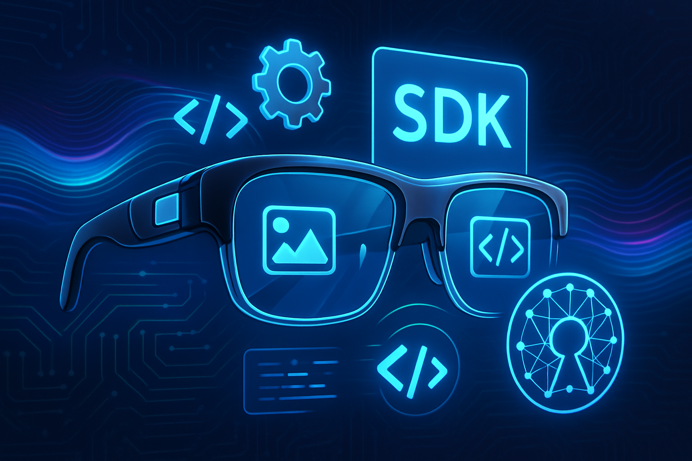

# PicoVision SDK



[](https://opensource.org/licenses/MIT)

PicoVision is a developer-friendly, open-source SDK for the ESP32-CAM, designed to power the next generation of wearable AI devices like smart glasses and AI pins. It provides a robust foundation for capturing sensor data, processing it with state-of-the-art AI models, and interacting with the user.

## Features

- **Modular Architecture:** Only use the components you need.
- **Multi-Provider AI Services:**
  - **Vision:** Supports OpenRouter and local Ollama servers.
  - **Speech-to-Text:** Supports Whisper via OpenRouter.
  - **Text-to-Speech:** Supports OpenAI's TTS service.
- **Hardware Abstraction:** Simple, high-level APIs for the camera, I2S microphone, and OLED display.
- **Secure & Configurable:** Manage credentials and settings securely, separate from your source code.
- **Power Management:** Utilizes deep sleep to maximize battery life.

## Getting Started

### 1. Prerequisites

- [PlatformIO CLI](https://platformio.org/install/cli) or the [PlatformIO IDE for VSCode](https://platformio.org/platformio_ide).
- An ESP32-CAM board.
- An I2S microphone (e.g., INMP441).
- An optional SSD1306 OLED display (128x64 pixels) for status messages.

### 2. Installation

1.  **Clone the repository:**
    ```bash
    git clone https://github.com/your-username/PicoVision.git
    cd PicoVision
    ```

2.  **Add Library Dependencies:**
    This project uses several libraries managed by PlatformIO. Ensure your `platformio.ini` includes the following `lib_deps`:
    ```ini
    lib_deps = 
        bblanchon/ArduinoJson @ ^7.0.0
        schreibfaul/ESP8266Audio @ ^1.9.7
        adafruit/Adafruit GFX Library @ ^1.11.9
        adafruit/Adafruit SSD1306 @ ^2.5.7
    ```
    PlatformIO should automatically install these when you build the project.

### 3. Configuration

1.  **Create your config file:**
    Copy the example file `src/core/Config.h.example` to a new file named `src/core/Config.h`.

    ```bash
    cp src/core/Config.h.example src/core/Config.h
    ```
    **IMPORTANT:** The `Config.h` file is ignored by git to protect your credentials. **Do not** commit it to version control.

2.  **Edit `src/core/Config.h`:**
    Fill in your Wi-Fi credentials, API keys, I2S microphone pinout, and I2C OLED display pins. Uncomment `#define PICOVISION_HAS_DISPLAY` to enable display support.

### 4. Build and Upload

Use the PlatformIO CLI or the VSCode extension to build and upload the project to your ESP32-CAM.

```bash
# Build the project
pio run

# Upload to the device
pio run --target upload
```

## How to Use

The `src/main.cpp` file contains the main application logic. The device is designed to operate in a low-power deep sleep mode and wakes up upon a button press (connected to `BUTTON_PIN`, GPIO 13).

Upon waking, the interaction flow is as follows:

1.  **Button Press:** The device wakes from deep sleep.
2.  **Record Audio:** The I2S microphone records a short audio clip (e.g., 3 seconds).
3.  **Transcribe Audio:** The recorded audio is sent to the configured Speech-to-Text service (Whisper via OpenRouter) for transcription.
4.  **Capture Image:** The camera captures an image.
5.  **Analyze Image:** The captured image and the transcribed question are sent to the configured Vision service (OpenRouter/Ollama) for analysis.
6.  **Synthesize and Play Response:** The textual response from the Vision service is sent to the configured Text-to-Speech service (OpenAI TTS) to synthesize audio, which is then played back through the I2S speaker.
7.  **Return to Deep Sleep:** After the interaction, the device returns to deep sleep to conserve power.

Status messages will be displayed on the OLED screen (if enabled) and printed to the Serial monitor throughout this process.

## Example Code Snippet (from `main.cpp`)

```cpp
#include <Arduino.h>
#include "PicoVisionSDK.h"
#include "core/Config.h" // For loading credentials

PicoVisionSDK sdk;

// Pin Definitions (from Config.h or main.cpp)
#define BUTTON_PIN 13 
#define LED_PIN 4
#define BUTTON_WAKEUP_PIN RTC_GPIO_NUM_13

void handle_interaction() {
  digitalWrite(LED_PIN, HIGH); 
  Serial.println("Button pressed. Starting interaction.");
#ifdef PICOVISION_HAS_DISPLAY
  sdk.displayManager.showMessage("Button pressed.\nStarting interaction.");
#endif
  
  // 1. Record Audio
#ifdef PICOVISION_HAS_DISPLAY
  sdk.displayManager.showMessage("Recording Audio...");
#endif
  AudioBuffer recordedAudio = sdk.audioManager.recordAudio(3000);

  // 2. Transcribe Audio
#ifdef PICOVISION_HAS_DISPLAY
  sdk.displayManager.showMessage("Transcribing Audio...");
#endif
  String question = sdk.sttService.transcribe(recordedAudio);
  sdk.audioManager.releaseAudio(recordedAudio);
  
  // ... (error handling and further steps)

  // 3. Capture Image
#ifdef PICOVISION_HAS_DISPLAY
  sdk.displayManager.showMessage("Capturing Image...");
#endif
  camera_fb_t* fb = sdk.cameraManager.captureImage();

  // 4. Analyze Image with the transcribed question
#ifdef PICOVISION_HAS_DISPLAY
  sdk.displayManager.showMessage("Analyzing Image...");
#endif
  String description = sdk.visionService.analyzeImage(sdk.sdk_config.vision_provider, fb, question);

  // 5. Synthesize and Play Response
  if (!description.isEmpty()) {
#ifdef PICOVISION_HAS_DISPLAY
    sdk.displayManager.showMessage("Synthesizing Speech...");
#endif
    AudioBuffer speech = sdk.ttsService.synthesize(description);
#ifdef PICOVISION_HAS_DISPLAY
    sdk.displayManager.showMessage("Playing Response...");
#endif
    sdk.audioManager.playAudio(speech);
  }

  digitalWrite(LED_PIN, LOW); 
  Serial.println("Interaction complete. Entering deep sleep.\n");
#ifdef PICOVISION_HAS_DISPLAY
  sdk.displayManager.showMessage("Interaction complete.\nSleeping...");
#endif
  delay(100); 
  esp_deep_sleep_start();
}

void setup() {
  Serial.begin(115200);
  // ... (initialization and deep sleep logic)
}

void loop() {
  // This loop will not be reached.
}
```

## Contributing

Contributions are welcome! Please see the [Development Roadmap](ROADMAP.md) for planned features.

## License

This project is licensed under the MIT License. See the [LICENSE](LICENSE) file for details.